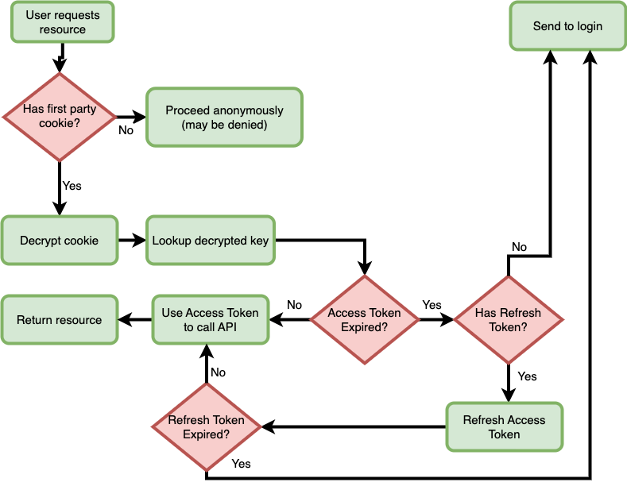

# Authentication in browser based applications (Science Portal & Storage User Interface)

- [OpenID Connect](#openid-connect)
  - [Login](#login)
- [BFF Pattern](#bff-pattern)
  - [After Successful Login](#after-successful-login)
  - [Authenticated Requests](#authenticated-requests)
    - [Flow](#general-steps)


## OpenID Connect

Browser based applications use the Authorization Code flow to authenticate users to the OIdP (OpenId Provider).  A good example
of how that works is shown at [Medium.com](https://darutk.medium.com/diagrams-of-all-the-openid-connect-flows-6968e3990660#c027), with `openid` included in the `scope` parameter.

Once that flow succeeds, the OpenID Connect Client (the application) will have an Access Token (and Refresh Token) to use to make authenticated calls on behalf of the user to an API, such as Cavern or Skaha.

As this flow is inefficient to use each time a request is made, the Access Token and Refresh Tokens are stored for the user, and retrieved when an authenticated call is necessary.  Access Tokens cannot be securely stored in the browser however, so a secure way of doing it is to implement the [Backend For Frontend (BFF)](#bff-pattern) pattern.

### Login

Login is supplied by the OpenID Connect Provider, and the endpoint can be looked up using the JSON document at the `.well-known/openid-configuration` endpoint, and looking up the `authorization_endpoint` key.  To start the Authorization Code flow, redirect the user to the `authorization_endpoint` with the following `properties`:

| Property | Value                           |
| -------  | ------------------------------- |
| `scope`  | `openid profile offline_access` |
| `redirect_uri` | `https://example.com/myapplication/oidc-callback` |
| `response_type` | `code` |
| `client_id` | `myclient_identifier` |


**Example**:
```
http://ska-iam.stfc.ac.uk/authorize?client_id=asfaslkfjlkj3-asdfdsdflkj&scope=openid%20profile%20offline_access&response_type=code&redirect_uri=https%3A%2F%2Fexample.com%2Fmyapplication%2Foidc-callback
```

If successful, this will call the URL at `redirect_uri` with a `code` parameter, containing a very short lived string value:

```
https://example.com/myapplication/oidc-callback?code=sdfue887hdyr
```

The `redirect_uri` endpoint can then pull the `code` query parameter, and use the `token_endpoint` from the `.well-known/openid-configuration` endpoint to exchange that `code` for tokens.  In order to do that, the client must authenticate with the same `client_id` used in the Login, as well as the `client_secret`, and POST the values.  The `client_secret` is typically generated by the client on registration.

**Example**:
```
$ export BASIC_AUTH_TOKEN = `echo "$CLIENT_ID:$CLIENT_SECRET" | base64`
$ curl --header "authorization: Basic $BASIC_AUTH_TOKEN" -d "grant_type=authorization_code" -d "code=sdfue887hdyr" -d "client_id=$CLIENT_ID" -d "client_secret=$CLIENT_SECRET" https://ska-iam.stfc.ac.uk/token
```

```json
{
  "access_token": "MTQ0NjJkZmQ5OTM2NDE1ZTZjNGZmZjI3",
  "expires_in": 3600,
  "refresh_token": "IwOGYzYTlmM2YxOTQ5MGE3YmNmMDFkNTVk",
  "id_token": "asklIILLdnsf9sdjsdfhkjhjh"
}
```

The application now has what it needs to make authenticated calls to the API(s).  Let's look at how they're stored and used with the [BFF Pattern](#bff-pattern).

## BFF Pattern

The UI applications use the Backend For Frontend (BFF) pattern to securely store tokens in a server-side cache, and can only be retrieve with an encrypted, HTTP-Only, and Secure, first-party cookie from the browser.  First-party cookies are cookies retrieved from a site from a direct visit to the site, rather than a request made from the page using JavaScript.  As browsers tighten security on cookies, this helps to future proof it.

All OpenID Connect (OIDC) interaction is handled by the [Nimbus OAuth2 Java Library](https://bitbucket.org/connect2id/oauth-2.0-sdk-with-openid-connect-extensions/src/master/).

### After Successful Login

The JSON document with a token set represents the Assets.  These Assets are stored in a Redis cache on the server, and a key is issued to retrieve them.  Each application has its own Token Cache.  The Assets are made up of the `access_token`, `refresh_token`, and the `expires_in` values.

That returned Assets key is SHA-256 encrypted, and set in the browser in a secure cookie.  That cookie is only good for this application, and cannot be read by JavaScript (`http-only`).

### Authenticated Requests

That encrypted cookie can now be used with the application to make authenticated requests.  The browser will send the cookie with each request, and follow the path as laid out in the diagram.



#### General Steps

1. User makes a request for a resource from a browser application
2. If there is no first-party cookie, then proceed as though anonymous.  If the resource is protected, then a 401 or 403 status code is returned.
   1. For the Science Portal, this means denying access with a modal login box as authentication is required.
   2. For the Storage UI, this means producing a button to optionally authenticate, as public browsing is allowed for Public items.
3. Decrypt the cookie if present, then use the key to look up the Assets in the Redis cache.
4. Use the Access Token from the Assets as a Bearer token in the request header to the API.

If the Access Token is valid (and the user is granted access to the resource), then the resource is returned.  The system will check the `expires_in` value to determine if the Access Token will soon expire, and if so, will request a refresh.

1. If no Refresh Token is present in the Assets, the user needs to re-authenticate.
2. If a Refresh Token is present in the Assets, then request a new Access Token from the token endpoint.
3. If the Refresh Token is expired (i.e. 401 is returned from the OIdP), then the user needs to re-authenticate.
4. Use the refreshed Access Token and return the resource to the user.
