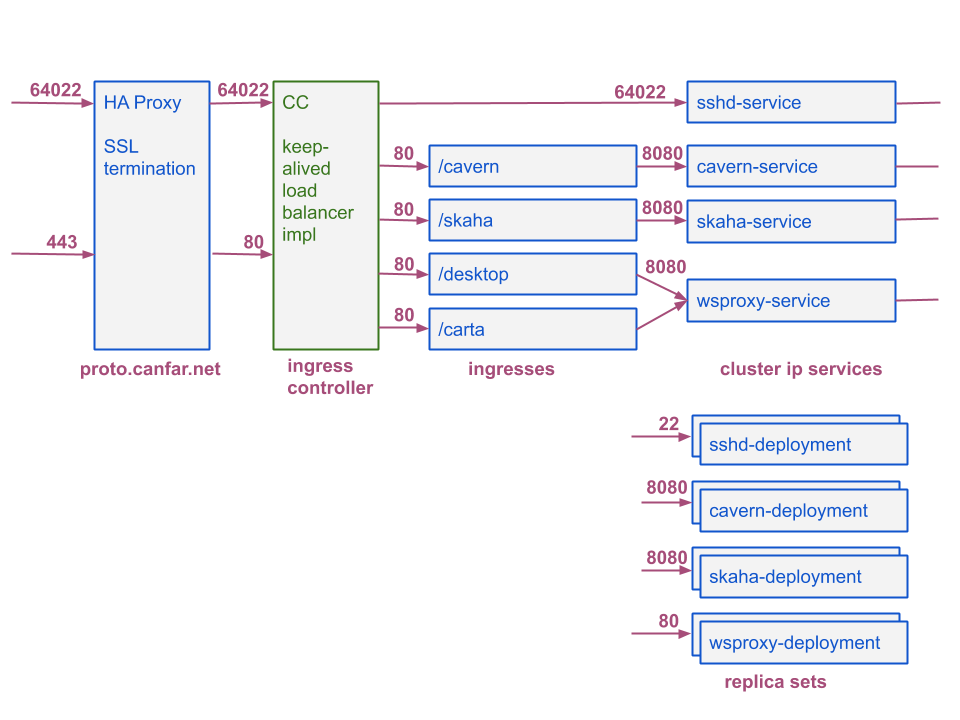
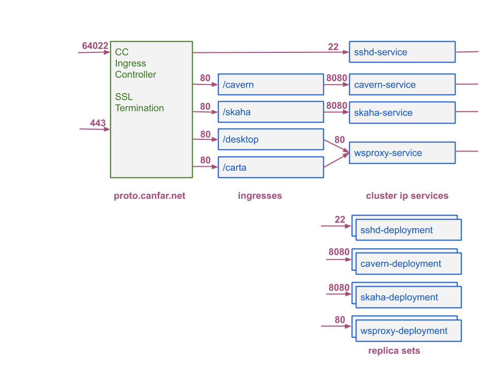

# skaha-k8s-config
Kubernetes deployment of skaha and cavern

## Overview
This module contains the prototype deployment configuration of skaha and cavern in kubernetes.

## kubernetes installation

Notes under an installation step indicate that configuration values must be changed to match the specifics of the kubernetes install.

### prerequisites

The following supporting applications must be installed:
   * `git`
   * `helm` is needed to install pods from harbour

### namespaces

Namespaces represent different parts of kubernetes where pods run, and can have different permissions, etc. The following namespaces are in use for cavern and skaha installation:
   * skaha-system - for system services (deployments)
   * skaha-workload - for user sessions and applications (jobs)
   * cadc-harbor - for harbor
   * cadc-sssd - for the sssd daemonsets

### installation steps

Installation of cavern, skaha, and sssh is done with kustomize.

1. First clone the skaha.git repo into the desired location on the target machine. A number of certificates and secrets are needed for the system to run, so these must be gathererd and placed in the associated kustomize directories:

```
.
./sssd
./sssd/config
./sssd/config/certs
./sssd/config/certs/ca.crt
./sssd/config/certs/cadc_CA_2029.crt
./sssd/config/sssd.conf
./servops-clientcert
./servops-clientcert/cadcproxy.pem
./skaha
./skaha/config
./skaha/config/k8s-config
./cavern
./cavern/sshd-certs
./cavern/sshd-certs/ssh_host_ed25519_key
./cavern/sshd-certs/ssh_host_ecdsa_key
./cavern/sshd-certs/ssh_host_rsa_key
```

The file `/skaha/config/k8s-config` must be handled specially.  See skaha/README.md for details

2. from the `k8s-config/kustomize` directory, run: `kubectl apply -k .` to apply the configuration. This command can also be issue to update the config or certificates at at later date.

### site-specific configuration

The following files contain configuration settings for the deployment:

- cavern tomcat:
  - catalina.properties refers to hostname
  - Cavern.properties refers to hostname
  - cavern volume is installation specific
  - cephfs path set to /cavern-dev
- cavern ingress:
  - ingress refers to hostname
- skaha tomcat:
  - catalina.properties refers to hostname
  - cavern volume is installation specific
- skaha wsproxy
  - ingress refers to hostname
  - python redirect scripts in images reference namespaces

When overlays on kustomize are complete these files won't be needed.


## Network

### Current network



The HA Proxy VM is there to support client proxy certificates.  The 'future' diagram below is what we'd like the network architecture to look like.  nginx in the ingress controller uses a newer version of openssl which requires apps (nginx in this case) to expose the configuration required to enable proxy certificates.  nginx does not allow that at this time.

This setup is not ideal because of the single point of failure in HA Proxy.

### Future network



In this setup SSL termination is done right in the ingress.  Because the ingress is load balanced it does not have a single point of failure.
